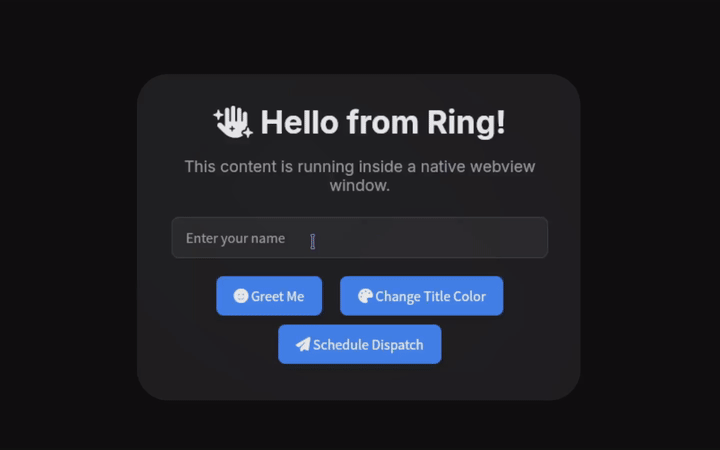

<div align="center">


# WebView

Create beautiful, cross-platform desktop apps with Ring and web technologies.

[language-ring]: https://img.shields.io/badge/language-Ring-2D54CB.svg?style=for-the-badge&labelColor=414868
[build-status]: https://img.shields.io/github/actions/workflow/status/ysdragon/webview/main.yml?branch=main&label=build&style=for-the-badge&labelColor=414868&logoColor=C0CAF5&color=8c73cc
[last-commit]: https://img.shields.io/github/last-commit/ysdragon/webview?style=for-the-badge&logo=github&logoColor=C0CAF5&labelColor=414868&color=8c73cc
[version]: https://img.shields.io/badge/dynamic/regex?url=https%3A%2F%2Fraw.githubusercontent.com%2Fysdragon%2Fwebview%2Fmaster%2Fpackage.ring&search=%3Aversion\s*%3D\s*%22([^%22]%2B)%22&replace=%241&style=for-the-badge&label=version&labelColor=414868&color=7664C6
[license]: https://img.shields.io/github/license/ysdragon/webview?style=for-the-badge&logo=opensourcehardware&label=License&logoColor=C0CAF5&labelColor=414868&color=8c73cc
[issues]: https://img.shields.io/github/issues/ysdragon/webview?color=8c73cc&style=for-the-badge&logo=github&logoColor=C0CAF5&labelColor=414868

[![][language-ring]](https://ring-lang.github.io/)
[![][build-status]](https://github.com/ysdragon/webview/actions)
[![][last-commit]](https://github.com/ysdragon/webview/pulse)
[![][version]](#)
[![][license]](https://github.com/ysdragon/webview/blob/main/LICENSE)
[![][issues]](https://github.com/ysdragon/webview/issues)

</div>

WebView is a powerful Ring library that allows you to create modern, cross-platform desktop applications using web technologies for the frontend, while using Ring as the backend. It provides a simple and intuitive API for building beautiful graphical user interfaces.

This project is made possible by the tiny [webview](https://github.com/webview/webview) library.

<div align="center">
  <h3>Demo</h3>
  <a href="examples/09_showcase.ring">
    
  </a>
  <br>
  <sub>
    <a href="examples/09_showcase.ring">View the source code for this demo</a>
  </sub>
</div>

## ✨ Features

- **Cross-Platform:** Build applications for Windows, macOS, Linux, and FreeBSD from a single codebase.
- **Modern UI:** Use familiar web technologies to design your user interface.
- **Two-Way Binding:** Seamlessly call Ring functions from JavaScript and vice-versa.
- **Easy to Use:** A simple and clean API makes it easy to get started.

## 🚀 Getting Started

Follow these instructions to get the WebView library up and running on your system.

### Prerequisites

- **[Ring](https://ring-lang.github.io/download.html):** Ensure you have Ring language version 1.24 or higher installed.

### Installation
<details>
<summary>Click here for instructions on  Linux</summary>

The compiled Linux library in this package requires GTK 4 and WebkitGTK 6.

*   ** Debian-based:** `sudo apt install libgtk-4-1 libwebkitgtk-6.0-4`
*   ** Arch-based:** `sudo pacman -S gtk4 webkitgtk-6.0`
*   ** Fedora:** `sudo dnf install gtk4 webkitgtk6.0`
*   ** Void Linux:** `sudo xbps-install gtk4 libwebkitgtk60`
*   ** Alpine Linux:** `sudo apk add webkit2gtk-6.0`

</details>

<details>
<summary>Click here for instructions on  Windows</summary>

The compiled Windows library in this package does not bundle any webview version with itself but rather uses the system-installed one.

The [Microsoft Edge WebView2](https://developer.microsoft.com/en-us/microsoft-edge/webview2/) runtime is required to be installed on the system for any version of Windows before Windows 11. To manually update or install the latest version, follow the steps [here](https://github.com/MicrosoftEdge/WebView2Feedback/issues/3371#issuecomment-1500917825).

</details>

<details>
<summary>Click here for instructions on  FreeBSD</summary>

The compiled FreeBSD library in this package requires WebKitGTK 6.

*   **FreeBSD systems:** `sudo pkg install webkit2-gtk_60`

</details>

<details>
<summary>Click here for instructions on  macOS</summary>

The compiled macOS library in this package uses the built-in WebKit framework.

*   **macOS systems:** No additional dependencies required. The WebKit framework is included with macOS.

</details>

- **Install the library using RingPM:**
    ```sh
    ringpm install webview from ysdragon
    ```

## 💻 Usage

Creating a basic WebView application is straightforward. Here’s a simple example:

```ring
# Load the webview library
load "webview.ring"

# Create a new WebView instance.
oWebView = new WebView()

oWebView {
    # Set the title of the native window.
    setTitle("My First WebView App")

    # Set the size of the window (width, height, hint).
    # WEBVIEW_HINT_NONE allows the window to be resized.
    setSize(800, 600, WEBVIEW_HINT_NONE)

    # Load HTML content into the webview.
    setHtml(`<h1>Welcome to Ring WebView!</h1>`)

    # Run the main event loop. This will block until the window is closed.
    run()
}

# This message will be displayed after the webview window is closed.
see "Application Closed." + nl
```

This code snippet creates a window, sets its title and size, loads some HTML, and runs the application loop.

For more advanced examples, see the [`examples/`](examples/) directory.

## 📚 API Reference

For a detailed list of all available functions, classes, and methods, please refer to our [API reference documentation](docs/REFERENCE.md).

## 📖 Usage Guide

For practical examples and guides on how to use the library, check out our [Usage Guide](docs/USAGE.md).

## 🛠️ Development

If you want to contribute to the development of Ring WebView or build it from source, follow these steps.

### Prerequisites

- **CMake:** Version 3.16 or higher.
- **C Compiler:** A C compiler compatible with your platform (e.g., GCC, Clang, MSVC).
- **[Ring](https://github.com/ring-lang/ring):** You need to have the Ring language source code available on your machine.

### Build Steps

1. **Clone the Repository:**
   Clone the WebView repository to your local machine.
   ```sh
   git clone https://github.com/ysdragon/webview.git --recursive
   ```
   > **NOTE**: Skip this step if you have already installed the library using RingPM.

2.  **Set the `RING` Environment Variable:**
    Before running CMake, you must set the `RING` environment variable to point to the root directory of the Ring language source code.
    - Windows
      - Command Prompt
          ```cmd
          set RING=X:\path\to\ring
          ```
      - PowerShell
          ```powershell
          $env:RING = "X:\path\to\ring"
          ```

    - Unix
      ```bash
      export RING=/path/to/ring
      ```

3.  **Configure with CMake:**
    Create a build directory and run CMake from within it.
    ```sh
    mkdir build
    cd build
    cmake ..
    ```

4.  **Build the Project:**
    Compile the source code using the build toolchain configured by CMake (e.g., Make, Ninja).
    ```sh
    cmake --build .
    ```

The compiled library will be placed in the `lib/<os>/<arch>` directory.

## 🤝 Contributing

Contributions are welcome! If you have ideas for improvements or have found a bug, please open an issue or submit a pull request.

## 📄 License

This project is licensed under the MIT License. See the [`LICENSE`](LICENSE) file for details.