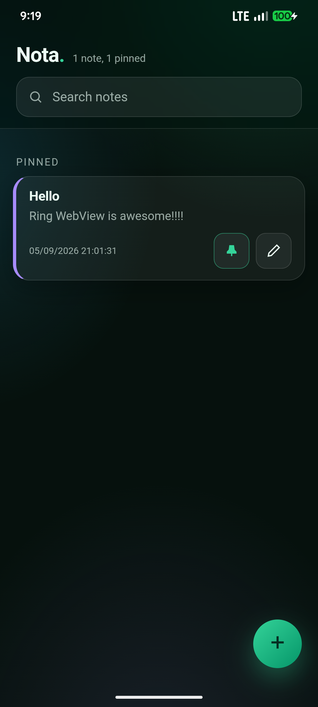

# Nota — Ring WebView on Android

A real notes app with a glassmorphism mobile UI, built with Ring + WebView.
Same-language backend as desktop: Ring owns the state, JavaScript renders it.



## What it does

- Add, edit, delete, pin, and search notes
- Color-coded glass cards, bottom-sheet editor, toasts
- Persists to `notes.db` in the app's `filesDir` (survives restarts)
- Survives rotation and renderer kills (system memory pressure)

## Bridge pattern

Ring never touches JSON text. Binds receive Ring lists (decoded from the
JS argument array) and `wreturn` the full notes list back; JS re-renders
from the promise resolution:

| JS call | Ring callback |
|---|---|
| `getState()` | `fetchNotes` |
| `note_save([id, title, body, color, pinned])` | `storeNote` |
| `note_delete([id])` | `removeNote` |
| `note_pin([id])` | `toggleNotePin` |

The first pull is driven by native `onDomReady` (`evalJS("refresh()")`),
which runs strictly after the bind shim is injected — no polling.

## Build

Needs [ring2apk](https://github.com/ysdragon/ring2apk):

```sh
ringpm install ring2apk from ysdragon
cd examples/android
ring2apk build        # → build/webviewdemo-debug.apk
ring2apk run          # build + install + launch + logcat
adb logcat -s RingOutput:D   # `see` output
```

## Layout

```
ring/main.ring        # app: state, binds, persistence, embedded UI
ring/fulltest.ring    # backend conformance suite (20 checks)
ring/src/             # webview.ring loader (same API as desktop)
src/cpp/              # libmain.so: Ring VM + backend (ring/ vendored, ignored by git)
src/java/             # MainActivity mirror (canonical copy in src/android/)
ring2apk.ring         # package io.github.ysdragon.webview, arm64-v8a
```
